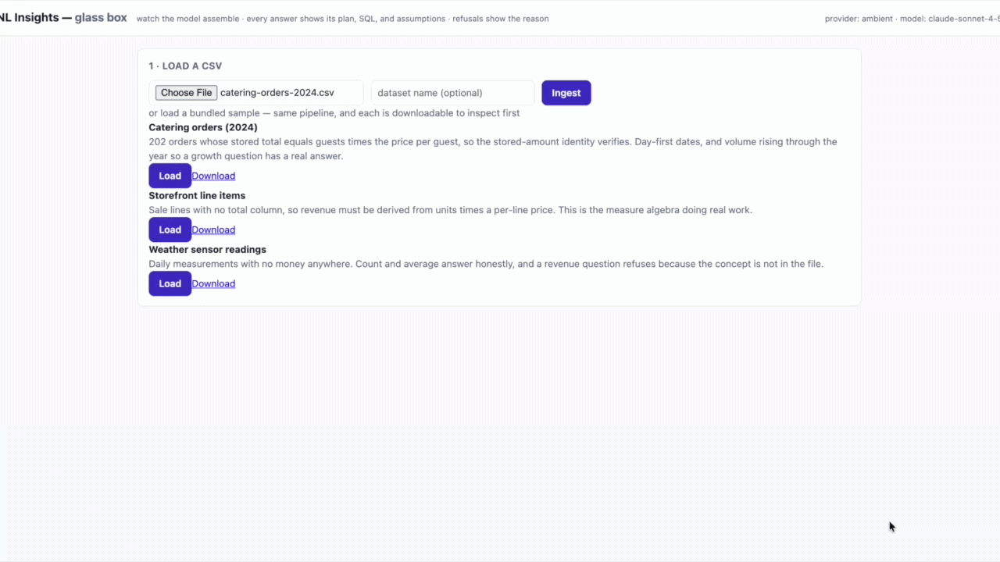
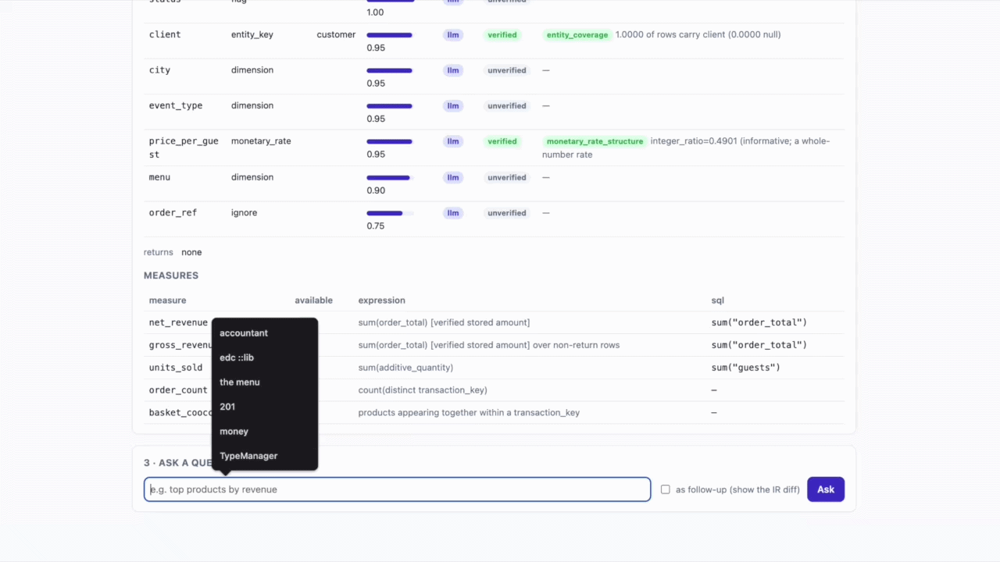
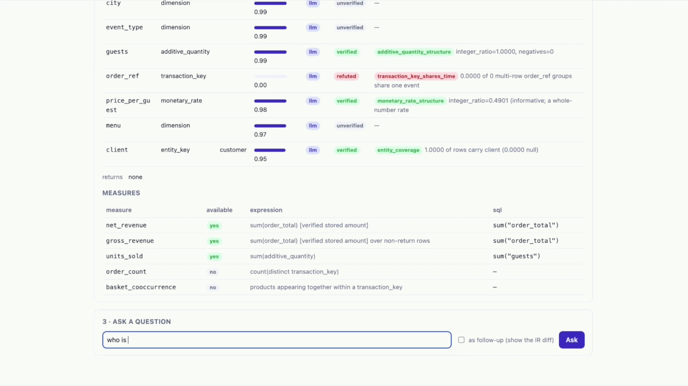
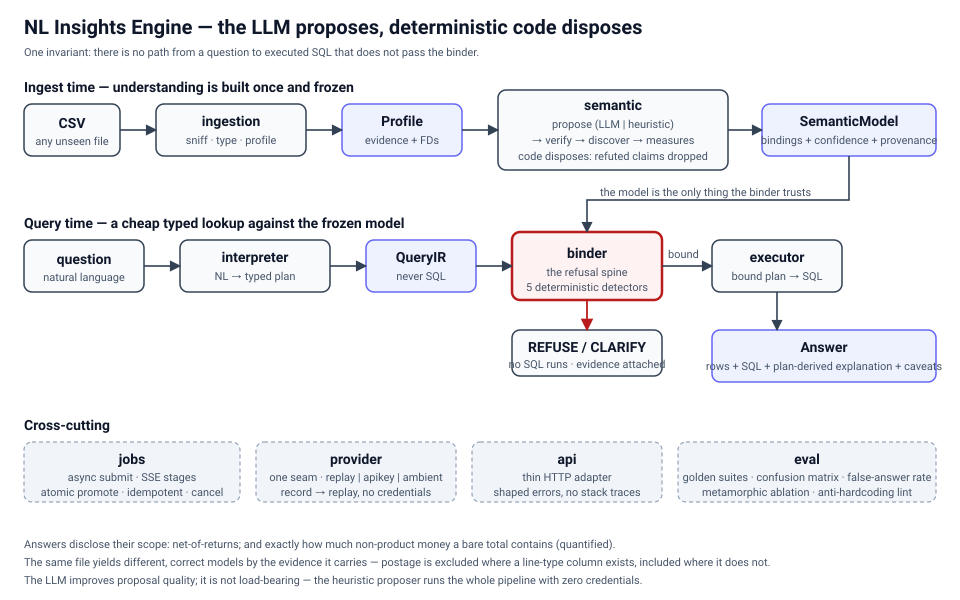

# NL Insights Engine

Answer natural-language questions about **any** transactional CSV it has never seen —
infer the schema from the file itself, no code changes per dataset.

## See it run

Three short recordings, in order. Each has one thing to watch for.



**1. Ingest and the stage tree.** The file arrives and the stage tree assembles through
sniffing, profiling, date resolution, inference, verification, and promotion: the work is
visible rather than hidden behind a spinner.



**2. The understanding, then an answer.** The model's understanding is a readable artifact:
each column's role with a confidence, whether it came from the model, and the verifier result
that confirmed or refuted it, then an answer that states its formula and the SQL it ran.



**3. A proposal refuted, and the capabilities that depended on it withdrawn.** `order_ref` was
proposed as the transaction key **by the model**, but the deterministic verifier disproved it
with evidence (`transaction_key_shares_time: 0.0000 of 0 multi-row order_ref groups share one
event`), so its confidence reads 0.00 and it is badged **REFUTED**. Directly below, `order_count`
and `basket_cooccurrence` are marked **not available**. That is the whole thesis in one frame: the
model proposed, the deterministic layer disproved it with evidence, and the system **withdrew the
capabilities that depended on it** rather than answering anyway.

The design principle everything follows from: the system's *understanding* of a file
is a first-class, machine-checked artifact (a **Semantic Model** with evidence and
confidence), and every answer is a **typed plan validated against that model before
any SQL runs**. The LLM proposes; deterministic code disposes. There is no path from a
question to executed SQL that skips the binder.

**The full path is built** — ingestion, semantic model, interpreter, binder, executor,
async jobs + SSE, HTTP API, and an eval component. See **[DESIGN.md](DESIGN.md)** for the
architecture, the failure taxonomy (where schema inference breaks, honestly), the
decisions and rejected alternatives, and the cut list — plus the
[architecture diagram](docs/architecture.svg).



## Prerequisites

The only prerequisite is **[uv](https://docs.astral.sh/uv/)** (Astral's Python manager);
it installs Python 3.12 and every dependency itself. On a clean machine:

```bash
curl -LsSf https://astral.sh/uv/install.sh | sh    # or: pipx install uv / brew install uv
```

## Quickstart — zero credentials (the default)

The system runs against **committed LLM fixtures** by default (`--replay`), so a clean
machine gets a working endpoint with no API key and no network:

```bash
make setup       # uv installs Python 3.12 + deps into a local .venv
make run         # serves http://127.0.0.1:8000 with the replay provider
curl -s localhost:8000/health
# {"status":"ok","provider":"replay","model":"claude-sonnet-4-5"}
```

Replay **fails loudly on a cache miss** — it never falls back to a live call, so a run
that would need the network can't silently pretend to be hermetic.

### Ask it a question — no credentials

A tiny demo dataset (`assets/demo/store-orders.csv`) ships with **committed replay
fixtures** for five example questions, so the whole loop — upload, watch the model
assemble over SSE, ask, answer, and *refuse* — runs with no API key:

```bash
# 1. submit the demo CSV → a job id  (curl -F multipart, or --data-binary raw)
curl -s -X POST 'localhost:8000/datasets?name=demo' -F 'file=@assets/demo/store-orders.csv'

# 2. stream the stages as the model is built (sniffing → … → verifying → promoting)
curl -N localhost:8000/jobs/<job_id>/stream

# 3. inspect what the system understood
curl -s localhost:8000/datasets/demo                 # the Semantic Model

# 4. ask a bundled question → a query job → the answer (or a refusal, with a reason)
curl -s -X POST localhost:8000/datasets/demo/query \
  -H 'content-type: application/json' -d '{"question":"top products by revenue"}'
curl -s localhost:8000/jobs/<query_job_id>           # Answer, plan, SQL, caveats
```

The bundled questions: **"top products by revenue"**, **"how many orders were there"**,
**"units sold by product"**, **"which products are most often bought together"**, and — to
show refusal on the credential-free path — **"how many distinct suppliers are there"** (nothing in the file maps to a supplier, and the
model declines rather than inventing one). The glass-box UI at
[http://localhost:8000/](http://localhost:8000/) does all of this in the browser.

**Three bundled sample datasets** load in one click from that UI (or `GET /samples`,
`POST /samples/{id}`, `GET /samples/{id}/download`) so a grader can skip the upload and
still exercise the whole pipeline. They are chosen to walk the taxonomy: a catering file
with a verified stored total, a storefront file whose revenue is *derived* from unit price
times quantity (no total column), and a sensor-readings file with no money at all, so a
revenue question is refused rather than invented. Each `id` is a key into a fixed
allowlist, never a filename: an unknown id is a shaped 404 and no request string ever
reaches the filesystem. A sample runs the exact same ingest as an upload, and a repeat
click reuses the dataset instead of duplicating it.

These cassettes are **real recordings from a live model** — both role proposal and
interpretation (`recorded_by: "recorded (ambient)"` in `fixtures/llm/`) — so the
credential-free demo replays the actual "LLM proposes, code disposes" pipeline, not a
hand-written stand-in. Regenerate them with `uv run --extra ambient python
scripts/record_cassettes.py` (needs the local `claude` CLI).

**Any CSV ingests with no credentials.** Role inference has a deterministic **heuristic
fallback**: when no LLM is available, the system proposes roles from the profiler's
evidence and the *same* verifiers test them, so a file it has never seen still builds a
usable model — every binding marked `provenance: "heuristic"`. The LLM improves proposal
quality; it is not required for ingestion. Asking a **new** natural-language question
(one without a committed fixture) is the one hop that needs the model — set
`--provider apikey` (with `ANTHROPIC_API_KEY`) or `--provider ambient`; replay says so
plainly with a `needs_llm` message rather than a cache-key dump.

Every error is shaped — `{"error":{"code","message","details"}}`, never a stack trace, and any server filesystem path is stripped from the message before it crosses the boundary.

## LLM provider — one interface, three auth paths

Every LLM call is a *structured-output* request (`(model, system, prompt, schema)`),
which makes each call a pure function we can record and replay. `src/nl_insights/provider/`:

| Path | How | When |
| --- | --- | --- |
| `replay` *(default)* | committed fixtures in `fixtures/llm/` | clean machine, CI, live demo — **no credentials** |
| `apikey` | Anthropic API via `ANTHROPIC_API_KEY` | a grader with their own key |
| `ambient` | Claude subscription auth via the agent SDK | our development path (no billed key) |

Record fixtures from a live provider, then commit them:

```bash
uv sync --extra apikey
ANTHROPIC_API_KEY=… uv run nl-insights serve --provider apikey --record
# each response is written to fixtures/llm/<sha256(request)>.json
```

### Deployment resource guards (env, opt-in)

The server accepts uploads up to a cap and can refuse when the disk is nearly full. Both
are **env-overridable**, and the disk floor is **off by default** so a clean clone on any
machine — even a nearly-full laptop — just works:

| Env var | Default | Meaning |
| --- | --- | --- |
| `NL_INSIGHTS_MAX_UPLOAD_BYTES` | `524288000` (500 MiB) | largest upload accepted; mirror `client_max_body_size` in nginx |
| `NL_INSIGHTS_MIN_FREE_BYTES` | `0` (no floor) | refuse a new upload if it would drop free space below this; **the deployment sets this** to protect a shared box |

With the floor at `0`, an upload is declined only if it literally would not fit. A public
deployment should set `NL_INSIGHTS_MIN_FREE_BYTES` explicitly (e.g. a few GiB) so a full
disk is a clean `507`, not an out-of-space crash — protection is opt-in at the server, not
a repo default that would fail a grader on a fullish machine.

## Architecture (each package owns one artifact)

```
CSV ─▶ ingestion ─▶ Profile ─▶ semantic ─▶ SemanticModel ◀── UI (inspect)
                                              │
question ─▶ interpreter ─▶ QueryIR ─▶ binder ─┴▶ ANSWERABLE | REFUSE | CLARIFY
                                              │
                                       executor ─▶ Answer (+ plan-derived explanation)

jobs   wraps ingestion + query (ids, status, SSE, cancellation)
api    exposes it;  eval grades it (golden + refusal suites)
```

Refusal is not the model choosing to be honest — the **binder** validates every plan
against the real inferred schema, so an invented column or an unresolvable measure is
caught deterministically before execution.

## Development

```bash
make check        # ruff lint + format check + mypy (strict) + eval + pytest
make eval         # anti-hardcoding lint + a golden-suite confusion matrix
```

CI runs the same on every push, key-free (replay).

## How do you know it works — the `eval` component

`make eval` (and `python -m nl_insights.eval`) runs the first two of the four checks below
and prints a **refusal confusion matrix** with a **false-answer rate** (the metric
that matters — invented answers; false refusal is reported separately as the cheaper
error):

- **Anti-hardcoding lint** — fails the build if any development-dataset identifier appears
  in the shipped engine surface — every `*.py` under `src/nl_insights` (including the
  interpreter's SYSTEM prompt) **and** the shipped static UI (`index.html`/JS) — making
  "nothing is dataset-specific" *falsifiable* rather than asserted. (It has already caught
  its own author.) Data-bearing trees (`fixtures/`, `assets/`, `tests/`) are out of scope
  by design: they legitimately hold the fixtures' real values.
- **Golden verdict suites** — each question carries the verdict class it must earn.
- **Metamorphic ablation** — drop a column an answer depends on, re-ingest, and the same
  question now *refuses* — proving refusal is driven by the data, not the phrasing.
- **Header-stripping** — rewrite headers to `col_1…col_N` and the same structure is still
  inferred; names are only a weak signal.

All four are hermetic — no fixtures, no credentials; `make eval` runs the first two, and
`make check` runs all four in CI on every push.

A small number of `pytest` tests are gated on an optional local fixture that is not
distributed with the repo; the committed synthetic slice exercises the same paths, so the
suite is green without it.

## Datasets

Two fixtures, deliberately different shapes, so the system isn't over-fit to one.

- **Synthetic retail slice** (`assets/nl-insights/synthetic-retail.csv`) — **committed**,
  generated by `scripts/make_synthetic.py`. A 25-column shape with a pre-computed
  `line_revenue` and explicit flags (`line_type`, `is_product_line`, `is_complete_quarter`),
  deliberately unlike raw UCI, so the semantic layer is exercised against a file that already
  carries a verified stored amount and a fact partition.
- **Raw UCI Online Retail** (`assets/raw-uci-online-retail.csv`) — **fetched** (large, so
  `assets/*.csv` is gitignored). 8 columns, *no* revenue column (must be derived from
  `Quantity × UnitPrice`), `C`-prefixed cancellations, ~25% null `CustomerID`, and
  month-first (`m/d/yyyy`) dates the ingester resolves *by evidence*. Downloaded from the UCI
  archive and converted from `.xlsx`.

```bash
make data     # downloads raw UCI (the synthetic slice is already committed)
```

A system developed only against a file that already has a computed revenue column would fail
the live walkthrough, where the CSV is likelier to look like raw UCI — hence two shapes
from day one.

## Ingestion & profiling

`nl_insights.ingestion.ingest(path, data_dir=…)` loads a CSV into a **per-dataset
DuckDB file** (writers for different datasets never contend) and returns a
deterministic **Profile** computed by SQL over the *whole* table — per-column types,
null rates, cardinalities, uniqueness, min/max, numeric sign mix and integer
dominance, top values, samples, and candidate **functional dependencies**. No LLM is
involved; this is the evidence base the semantic layer reasons over. Dialect (delimiter,
quoting, encoding, header) is sniffed and validated — a ragged file fails loudly rather
than loading mangled — and ambiguous `dd/mm` vs `mm/dd` dates are settled by the data
(a component > 12), never by locale.
